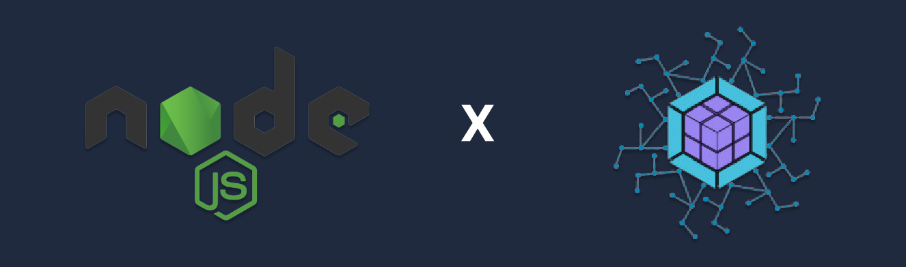

# This repo has been relocated. 
# This repo has been relocated. 
# This repo has been relocated. 
All contributions should go to: https://github.com/module-federation/nextjs-mf/tree/main/packages/node

	<!--  for version -->
  
	
  <!-- for downloads -->
  
 

<strong>A package to bring the concept and power of module federation to NodeJS.</strong>

## ⚡ Features
- Exposes two Webpack Plugins to enable Module Federation.
- Can exported as UniversalFederationPlugin or NodeFederationPlugin with StreamingTargetPlugin
- Allows server to fetch chunks across the network.
- Allow distributed deployments of federated applications.

## 🔑 License
- MIT @[ScriptedAlchemy](https://github.com/ScriptedAlchemy)

## 👨‍💻 Contributors
List of our amazing contributors 💥

